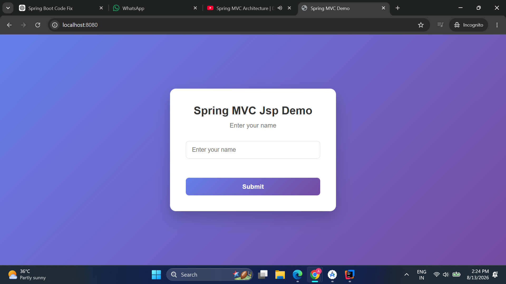
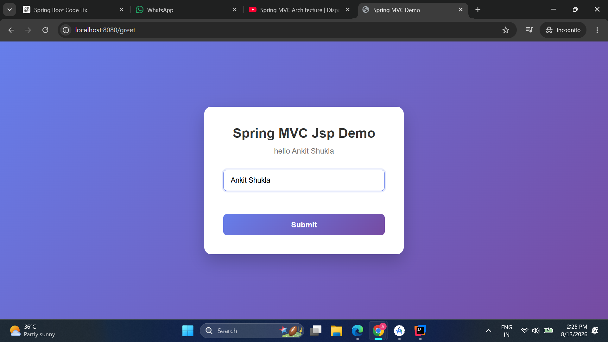

# Spring MVC JSP Web Application

A simple **Spring MVC + JSP web application** built using **Spring Framework** and **Embedded Apache Tomcat**.

This project demonstrates a basic Spring MVC request flow where a user enters their name and receives a personalized greeting.

## 📸 Application Screenshots

### 🏠 Home Page

The application opens with a simple form where the user can enter their name.



### 👋 Greeting Page

After submitting the name, Spring MVC processes the request and displays a personalized greeting.



## 🚀 Features

- Spring MVC architecture
- JSP-based frontend
- Embedded Apache Tomcat
- DispatcherServlet configuration
- Controller-based request handling
- GET and POST request handling
- Model data transfer between Controller and JSP
- Request parameter handling
- JSP ViewResolver
- External CSS styling
- Static resource handling
- Form submission and personalized greeting

## 🛠️ Tech Stack

| Technology | Usage |
|---|---|
| Java | Backend development |
| Spring MVC | Web framework |
| JSP | View layer |
| Apache Tomcat | Embedded web server |
| Maven | Build and dependency management |
| HTML | Frontend structure |
| CSS | Frontend styling |
| IntelliJ IDEA | Development |

## 🔄 Application Flow

```text
Browser
   ↓
DispatcherServlet
   ↓
Controller
   ↓
Model
   ↓
ViewResolver
   ↓
JSP
   ↓
Browser
